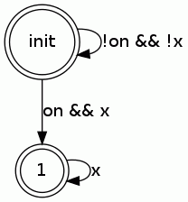
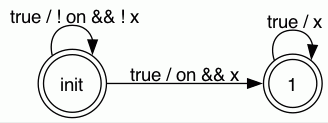

# Simple starter
 
- Initially light is false until on is true
- Once on is true, light is true forever

```ocaml
input on : bool
output light : bool
variable x : bool

rely {}
guarantee {}
where { light = x }

setup:
  ensures { x = false }
  x := false 
  
loop:
  if on then x := true;
  light := x
  
// automata input : a single state with a true arrow
// automata output : (from rely and guarantee) :  
    output.gif
// automata io : io.gif

```

## Automaton for the 'guarantee formula'

## Synchronized product for code annotation 

