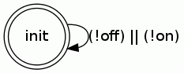
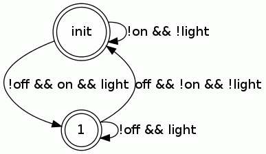
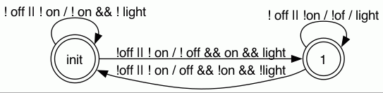

# Simple interruptor with input on and off and output light.
This example is the first attempt to use a LTL for the
input specification.

- initially, light remains false until on is true 
- if on is true, light remains true until off is true
- if off is true, light remains false until on is true
- on and off cannot be true at the same instant

```ocaml
input on,off : bool
output light : bool
variable x : bool 

rely { [] ( not on \/ not off) }
guarantee { 
  (on R ( NOT x \/ on)) /\ 
    [] (on -> off R (x \/ off)) /\ 
      [] (off -> on R ( NOT x \/ on))
} 
where { light = x}

setup:
  ensures { x = false }
  x := false
  
loop:
  if on then x := true
  else if off then x := false;
  light := x

```
## Automaton for the 'rely' formula



## Automata for the 'guarantee' formula 



## Synchronized product for code annotation


